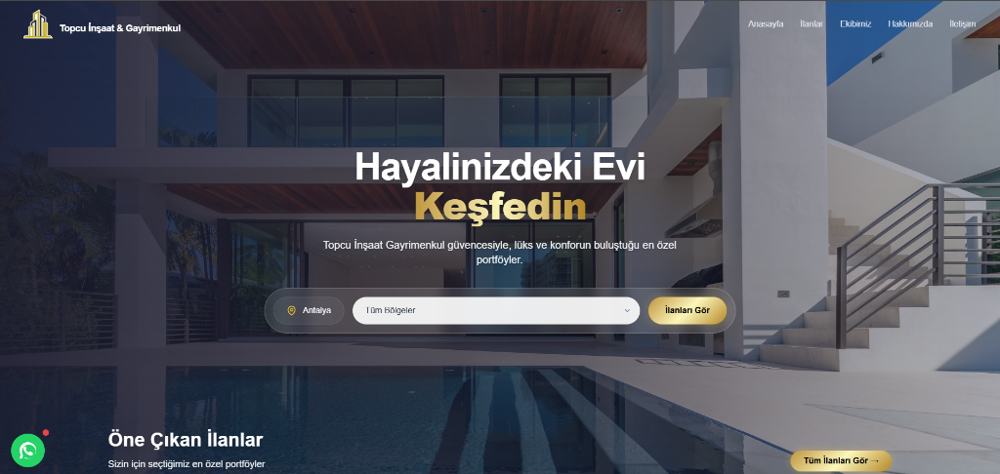
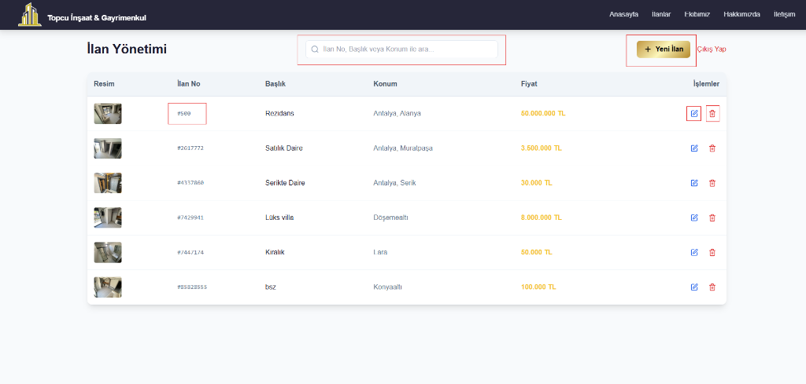
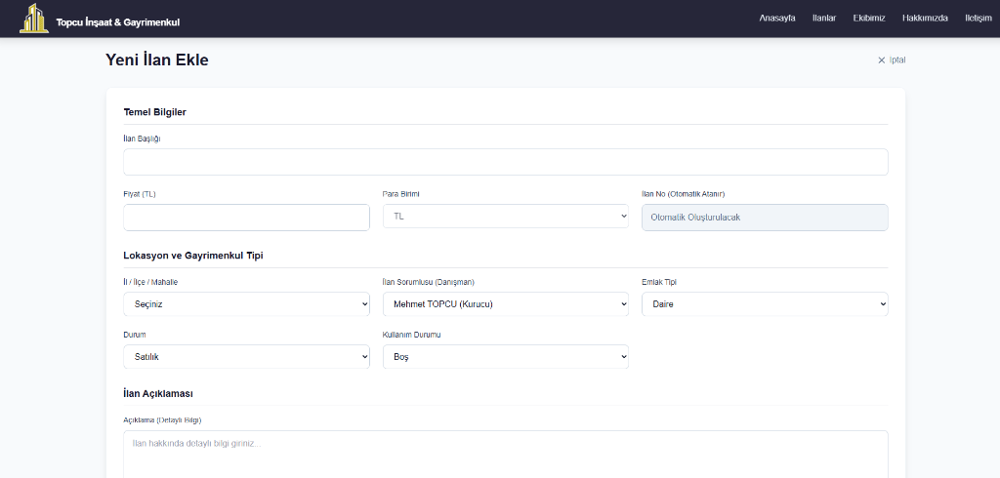
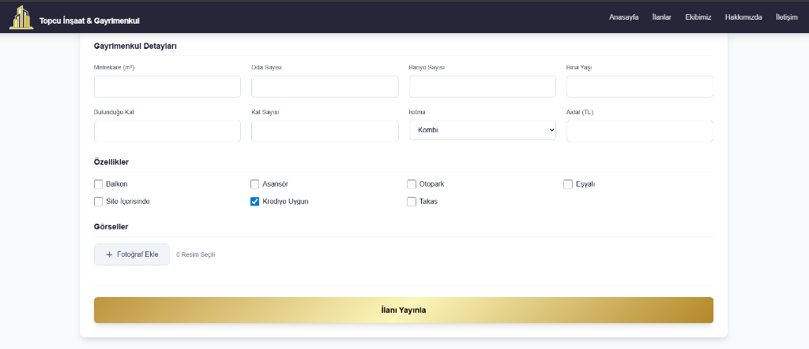

# Topcu İnşaat & Gayrimenkul - Web Sitesi Tanıtım ve Kullanım Rehberi

**Tarih:** 16 Ocak 2026  
**Hazırlayan:** Antigravity AI Yazılım Ekibi

Bu doküman, Topcu İnşaat & Gayrimenkul için geliştirilen modern, güvenli ve yönetilebilir emlak web sitesinin özelliklerini, kullanımını ve sağladığı teknik avantajları detaylandırmak amacıyla hazırlanmıştır.

---

## 1. Modern Kullanıcı Arayüzü (Frontend)

Müşterilerinizin siteye ilk girdikleri andan itibaren profesyonel bir deneyim yaşamaları hedeflenmiştir. Tasarımda kurumsal renkler (Lacivert & Altın) ve modern web trendleri kullanılmıştır.

### 🌟 Anasayfa ve Hızlı Arama
Kullanıcıları etkileyici bir tam ekran görsel ve kolay kullanımlı bir arama motoru karşılar.

**Öne Çıkan Özellikler:**
*   **Akıllı Arama:** Ziyaretçiler tek tıkla ilçe veya bölge seçerek hayallerindeki eve ulaşabilirler.
*   **Responsive Tasarım:** Telefon, tablet ve bilgisayarlarda kusursuz görünür.
*   **Hızlı Erişim:** WhatsApp butonu ile müşterileriniz size saniyeler içinde ulaşabilir.

---

## 2. Gelişmiş Yönetim Paneli (Admin Dashboard)

Site içeriğini teknik bilgiye ihtiyaç duymadan, tamamen Türkçe ve kolay bir arayüzle yönetebilirsiniz.

### 🔒 Güvenli Yönetici Girişi
Yönetim paneli halka açık değildir. Sadece yetkili personelin erişebileceği, özel olarak şifrelenmiş bir giriş ekranı ile korunmaktadır.

*   **Güvenlik Protokolü:** E-posta ve şifre kombinasyonu ile giriş yapılır.
*   **Estetik Arayüz:** Arka planda kurumsal kimliği yansıtan buzlu cam (Glassmorphism) efekti kullanılmıştır.

---

### 📋 İlan Yönetimi ve Listeleme
Tüm portföyünüzü tek bir ekrandan görüntüleyebilir, düzenleyebilir veya yayından kaldırabilirsiniz.

**Fonksiyonlar:**
*   **Anlık Durum:** İlanın fiyatını, konumunu ve başlığını listede hızlıca görebilirsiniz.
*   **Hızlı İşlemler:** Her satırın sağında bulunan "Düzenle" (Kalem) ve "Sil" (Çöp Kutusu) butonları ile saniyeler içinde işlem yapabilirsiniz.
*   **Arama:** Yüzlerce ilan arasından "İlan No" veya "Başlık" ile arama yaparak istediğiniz kaydı hemen bulabilirsiniz.

---

### ➕ Yeni İlan Ekleme & Düzenleme
İlan eklemek bir form doldurmak kadar basittir. Sistem sizi adım adım yönlendirir.

**Adım 1: Temel Bilgiler**
İlan başlığı, fiyatı, konumu ve danışman bilgisi gibi temel verilerin girildiği ekran.
*Not: İlan Numarası sistem tarafından otomatik ve sıralı olarak (Örn: #500, #501) atanır, karışıklığı önler.*

**Adım 2: Detaylar ve Fotoğraflar**
Evin metrekaresi, oda sayısı, özellikleri (Balkon, Asansör vb.) ve fotoğraflarının yüklendiği alan.

*   **Esnek Oda Sayısı:** "4+1", "3.5+1", "Stüdyo" gibi her türlü oda tipi girilebilir.
*   **Özellik Seçimi:** Asansör, Otopark, Kredi Uygunluğu gibi özellikler tek tıkla seçilir.
*   **Görsel Yönetimi:** İlan fotoğraflarını topluca seçip yükleyebilirsiniz.

---

## 3. Teknik Altyapı ve Güvenlik

Web siteniz en güncel teknolojilerle donatılmıştır.

*   **⚡ Üstün Performans (Vite & React):** Sayfalar arası geçişlerde bekleme süresi yoktur. Site bir mobil uygulama hızında çalışır.
*   **🛡️ Veri Güvenliği (Supabase):** Tüm veriler ve fotoğraflar bulut tabanlı, yedekli ve şifreli sunucularda saklanır. Veri kaybı riski minimize edilmiştir.
*   **📱 %100 Mobil Uyum (Tailwind CSS):** Müşterileriniz sitenizi hangi cihazdan açarsa açsın, bozuk bir görüntüyle karşılaşmaz.
*   **🔍 SEO Dostu:** Google ve diğer arama motorlarının sitenizi anlaması ve üst sıralara taşıması için gerekli semantik kod yapısına sahiptir.

---

## 4. Sonuç
**Topcu İnşaat & Gayrimenkul** web sitesi, markanızın dijital dünyadaki prestijli yüzü olacak şekilde tasarlanmıştır. Hem müşterileriniz için kullanımı kolay bir arayüz sunar, hem de sizin için güçlü bir yönetim aracıdır.

Saygılarımızla.
